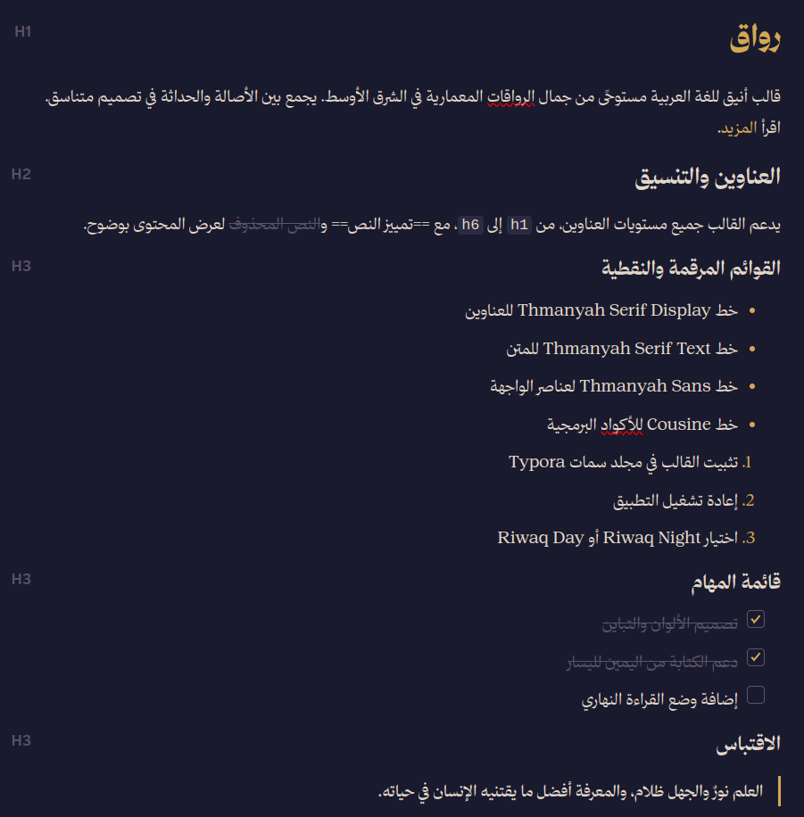
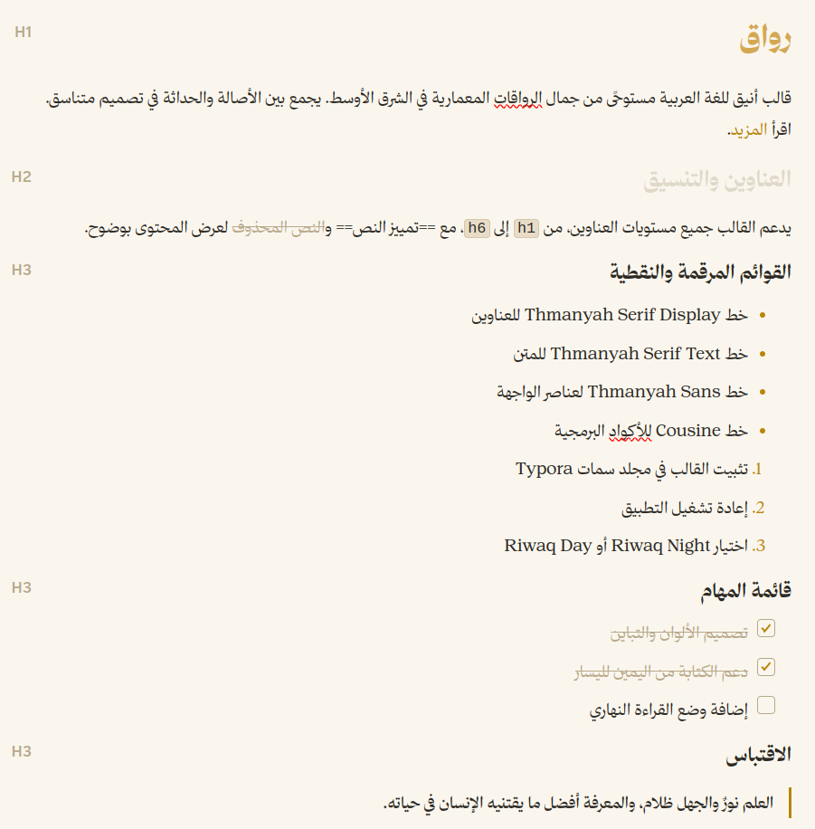

# Riwaq (رواق): Typora RTL Theme

A dark/light Arabic RTL theme for Typora, inspired by the elegance of Middle Eastern architectural porticos. Uses the **Thmanyah** font family (Sans, Serif Text, Serif Display).

## Preview


<div align="center">
  
  
</div>

| Night | Day |
|-------|-----|
| Deep navy `#1a1a2e` with warm gold accents | Warm cream `#faf6ee` with deep gold accents |


>  Designed and tested on macOS and Linux. Not fully tested, but should work for Windows. But this theme does not include styles for Windows “unibody” style.

## Install

1. Open Typora and go to **Settings → Appearance → Open Theme Folder**
2. Copy **both** `riwaq-night.css` and `riwaq-day.css` into that folder
3. Copy the **`riwaq/`** directory (containing fonts & code themes) into that same folder
4. Restart Typora
5. Select **Riwaq Night** or **Riwaq Day** from the Themes menu

The theme folder structure should look like this:

```
~/.config/Typora/themes/   (or %AppData%\Typora\themes\ on Windows)
├── riwaq-night.css
├── riwaq-day.css
└── riwaq/
    ├── code-dracula.css
    ├── code-3024-day.css
    ├── Cousine-Regular.woff
    └── thmanyah*.woff2
```

## Fonts

This theme bundles:
- **Thmanyah Serif Display** — headings
- **Thmanyah Serif Text** — body text
- **Thmanyah Sans** — UI/sidebar elements
- **Cousine** — monospace/code blocks

## License

- Theme CSS: MIT - see [LICENCE.md](./LICENCE.md)
- Thmanyah fonts: see `riwaq/LICENSE.pdf` (SIL Open Font License)
- Cousine font: Apache 2.0 (Google Fonts)